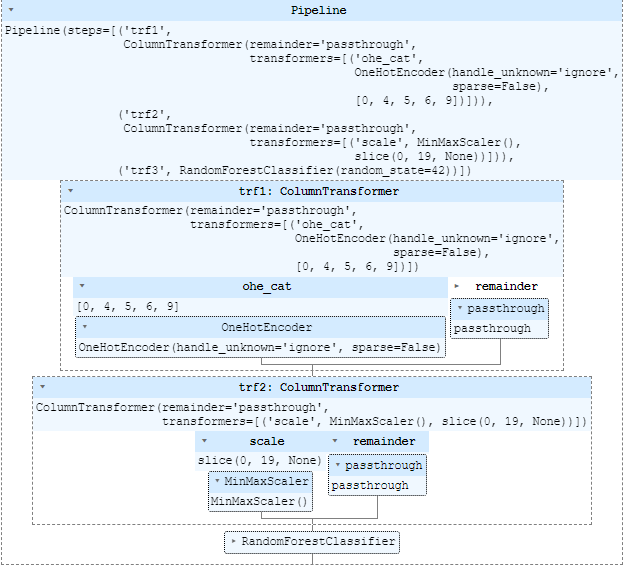

# Stroke Predition with Machine Learning

This project is build with flask and bootstrap framework powered by machine learning model trained on Random Forrest Algoritham with the 95.6% accuracy.


## Summary

- ML model is trained on data set from kaggle and before EDA and Feature Engineering is perfoemed on Dataset
- Machine Learning Pipeline is used in this project with transformers. 
- Pipeline contaions min-max scalar and Grid Search CV for Hyper parameter Tuning.
- Random Forrest Algoritham is also implementd inside the Pipeline.    


## Tech Stack
**Language:** Python, HTML, CSS

**Frameworks:** Flask, Bootstrap

**Libraries:** Numpy, Pandas, Matplotlib, Seaborn, Sklearn, pandas_profiling, pickle


## Deployed link

- [Click Me](https://github.com/choudharyprince890)


## Installation

Install dependencies with pip

```bash
pip install -r requirements.txt
```
Run the project with

```bash
python app.py
```
    
## Featuires
** Pipeline **


** Analysis **


## Screenshots of Project
** Pipeline **


** Analysis **


## Feedback

If you have any feedback, please reach out to us at. 
8360193315

